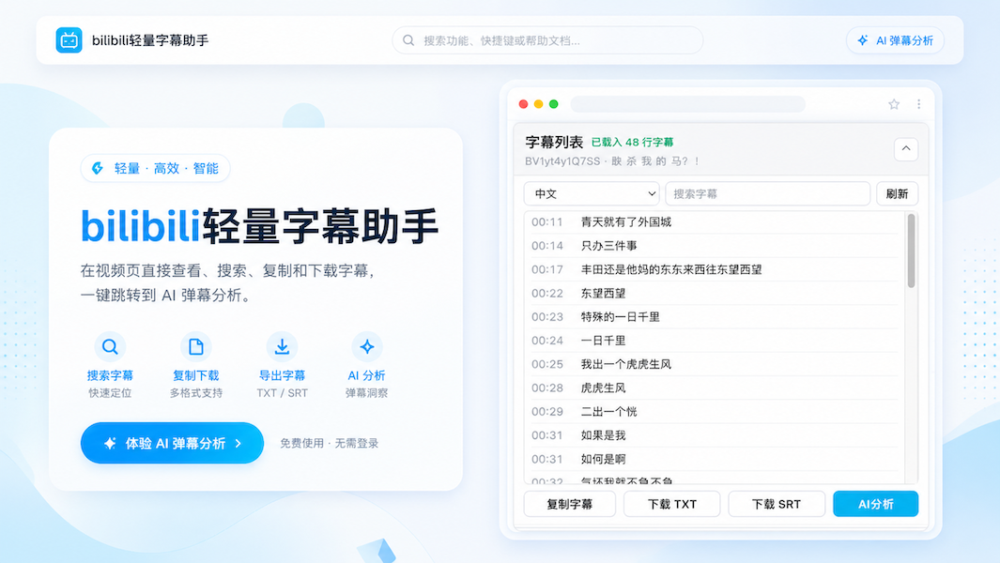

# 哔哩哔哩轻量字幕助手

这是 [danmu.liu-qi.cn](https://danmu.liu-qi.cn/) 的辅助浏览器插件，可用于下载 B 站视频字幕，并把当前视频一键带到 AI 深度分析页。

## 这是一个什么插件

哔哩哔哩轻量字幕助手会在 B 站视频页的右侧区域增加一个轻量字幕面板，让你不用离开当前页面，就能直接查看、搜索、复制和下载字幕。

如果你正在配合 [danmu.liu-qi.cn](https://danmu.liu-qi.cn/) 使用，它还可以把当前视频一键带到网站结果页，并默认切换到“字幕深度分析”。

## 你可以用它做什么

- 直接读取当前视频的可用字幕
- 按关键词搜索字幕内容
- 双击字幕跳转到对应播放时间
- 复制带时间码的字幕文本
- 下载 TXT 或 SRT 字幕文件
- 一键跳到 AI 深度分析页

## 安装

1. 打开 Chrome 或 Edge。
2. 进入 `chrome://extensions/`。
3. 开启右上角的“开发者模式”。
4. 点击“加载已解压的扩展程序”。
5. 选择本项目目录。

## 使用

1. 登录哔哩哔哩并打开一个普通视频页。
2. 在右侧找到“字幕列表”面板。
3. 选择字幕语言，或输入关键词搜索字幕。
4. 点击 `复制字幕`、`下载 TXT` 或 `下载 SRT`。
5. 点击 `AI分析` 打开 [danmu.liu-qi.cn](https://danmu.liu-qi.cn/) 并进入“字幕深度分析”。

## 适用范围

- 主要支持哔哩哔哩普通视频页
- 需要视频本身存在可用字幕

## 权限与隐私

扩展只申请实现字幕功能所需的最小权限：

- `downloads`：把字幕文件保存到本机下载目录
- `https://www.bilibili.com/video/*`：仅在 B 站视频页显示字幕面板
- `https://api.bilibili.com/*`：读取字幕轨道和视频信息
- `https://*.hdslb.com/*`：获取字幕文件正文

扩展不会读取或上传你的哔哩哔哩 Cookie。详细说明见 [PRIVACY.md](PRIVACY.md)。

## 常见问题

更多使用说明见 [SUPPORT.md](SUPPORT.md)。
